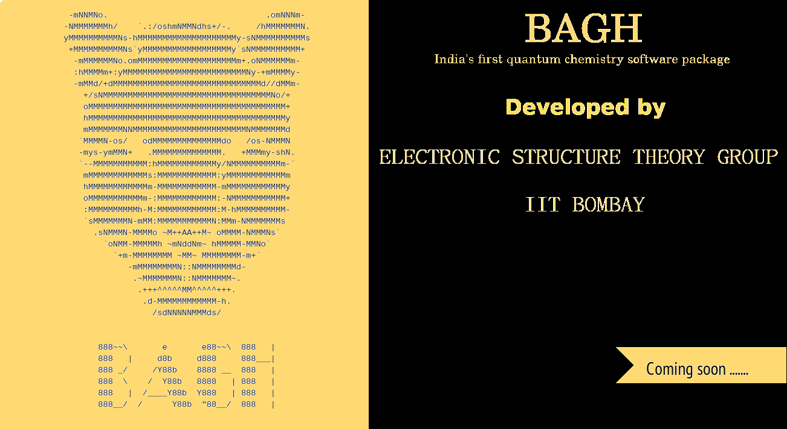

Welcome to Bagh's documentation!
===================================

**Bagh** is an electronic structure theory package developed in the Electronic Structure Theory Group, IIT Bombay. It mostly focuses on many body wave-functions based methods with special emphasis on relativistic effects.  Bagh is written primarily in python with bottleneck parts written in cython and fortran

.. note::

   This project is under active development.

Contents
--------

.. toctree::

   usage
   getting_started 
   basis
   methods_relativistic
   methods_non-Relativistic
   computational_options
   contact_information
   team
   

